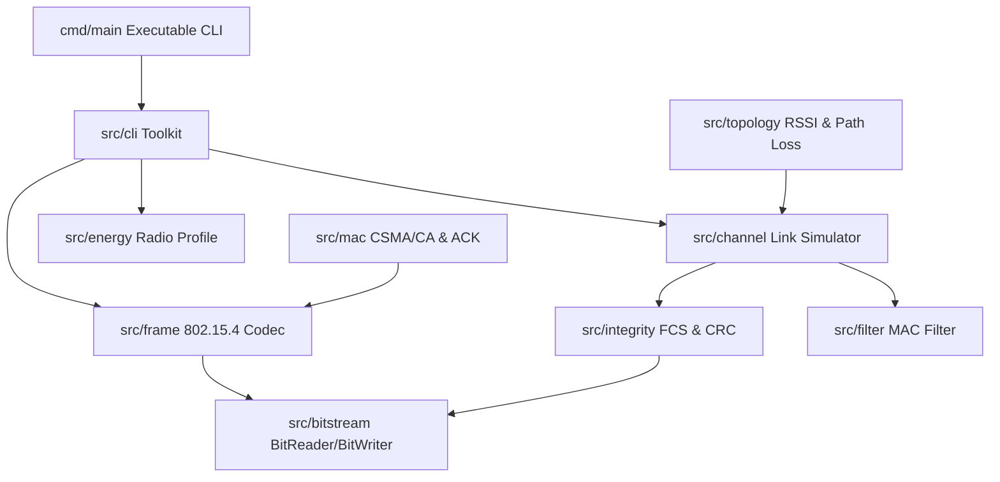

# MoonBit RadioFrame (`moonbit-radioframe`)

> **MoonBit 无线通信帧与链路仿真工具包**
> A modular, high-performance MoonBit toolkit for low-power wireless frame encoding/decoding (IEEE 802.15.4 specifications), bit-level packing, MAC address filtering, FCS checksum verification, in-memory channel impairment simulation, CSMA/CA backoff, and radio energy tracking.

---

## 📖 Overview

`moonbit-radioframe` provides an end-to-end framework for modeling, encoding, analyzing, and simulating low-power wireless communication protocols in pure MoonBit. 

Designed without hard dependencies on physical microcontrollers or hardware drivers, `moonbit-radioframe` serves as an experimental, educational, and testing infrastructure for MoonBit IoT protocols, wireless networking research, and Link-layer simulation.

---

## 🌟 Key Features

1. **Bitstream Engine (`src/bitstream`)**:
   - High-throughput `BitReader` and `BitWriter` supporting MSB-first and LSB-first bit orders.
   - Arbitrary bit-width integer field packing (1-64 bits) and non-byte-aligned slice operations.
   - Precise bit position manipulation, boundary checks, and alignment flushing.

2. **IEEE 802.15.4 Frame Codec (`src/frame`)**:
   - 16-bit Frame Control Field (FCF) parser and builder (Beacon, Data, ACK, MAC Cmd).
   - Addressing mode codecs (None, 16-bit Short, 64-bit Extended, 0xFFFF Broadcast).
   - PAN ID compression logic and auxiliary security header serialization.

3. **Integrity & Diagnostics (`src/integrity`)**:
   - IEEE 802.15.4 16-bit FCS CRC16-CCITT calculation.
   - CRC32 checksum engine for extended frame headers.
   - RFC 1071 16-bit Internet checksum & XOR parity checksums.
   - Automated frame corruption diagnostics and bit-flip / burst error injectors.

4. **MAC Filtering Engine (`src/filter`)**:
   - Promiscuous mode, local PAN ID validation, short/extended destination filtering, and broadcast handling.

5. **MAC Protocol Layer (`src/mac`)**:
   - Slotted/Unslotted CSMA/CA backoff simulator with dynamic exponent scaling.
   - Sequence-tracked ACK generation and timeout manager.
   - Retransmission stats collector and exponential retry handler.

6. **Channel Impairment Simulator (`src/channel`)**:
   - In-memory link simulator with configurable packet loss rate (PPM), latency distribution, jitter, duplication, and temporal collision detection windows.

7. **Network Graph & Topology (`src/topology`)**:
   - 3D spatial node positioning (`Position3D`) and link distance calculation.
   - Friis Free-Space and Log-Distance Path Loss models.
   - Received Signal Strength Indicator (RSSI dBm) and Link Quality Indicator (LQI 0-255) calculators.

8. **Radio Energy Model (`src/energy`)**:
   - Low-power radio energy state machine (Sleep, Idle/Listen, TX, RX, CCA).
   - Charge (mAh), energy (Joules), and estimated battery life model (e.g. for CC2530 transceivers).

9. **CLI & Diagnostics (`src/cli`, `cmd/main`)**:
   - Hexadecimal frame parsing and summary formatting.
   - Automated link simulation runner and statistical telemetry exporter.

---

## 🏗️ Architecture



---

## 🛠️ Package Layout

| Package Path | Description |
| :--- | :--- |
| [`src/bitstream`](file:///d:/%E6%9D%8E%E6%AC%A3%E6%80%A1%E5%88%9D%E5%AE%A12/src/bitstream) | Bit-level stream reader, writer, alignment & endianness helpers |
| [`src/integrity`](file:///d:/%E6%9D%8E%E6%AC%A3%E6%80%A1%E5%88%9D%E5%AE%A12/src/integrity) | CRC16-CCITT, CRC32, checksums and error diagnostic tools |
| [`src/frame`](file:///d:/%E6%9D%8E%E6%AC%A3%E6%80%A1%E5%88%9D%E5%AE%A12/src/frame) | IEEE 802.15.4 MAC frame structure, FCF and bitstream codec |
| [`src/filter`](file:///d:/%E6%9D%8E%E6%AC%A3%E6%80%A1%E5%88%9D%E5%AE%A12/src/filter) | Destination MAC address and PAN ID filter engine |
| [`src/mac`](file:///d:/%E6%9D%8E%E6%AC%A3%E6%80%A1%E5%88%9D%E5%AE%A12/src/mac) | CSMA/CA backoff simulator, ACK manager, and retry stats |
| [`src/channel`](file:///d:/%E6%9D%8E%E6%AC%A3%E6%80%A1%E5%88%9D%E5%AE%A12/src/channel) | In-memory channel model for loss, delay, jitter, and collision |
| [`src/topology`](file:///d:/%E6%9D%8E%E6%AC%A3%E6%80%A1%E5%88%9D%E5%AE%A12/src/topology) | 3D Node graph, Friis path loss model, RSSI & LQI calculators |
| [`src/energy`](file:///d:/%E6%9D%8E%E6%AC%A3%E6%80%A1%E5%88%9D%E5%AE%A12/src/energy) | Low-power radio energy state machine and battery estimation |
| [`src/cli`](file:///d:/%E6%9D%8E%E6%AC%A3%E6%80%A1%E5%88%9D%E5%AE%A12/src/cli) | Hex codec, frame summary formatter, and CLI simulation reporter |
| [`cmd/main`](file:///d:/%E6%9D%8E%E6%AC%A3%E6%80%A1%E5%88%9D%E5%AE%A12/cmd/main) | Main CLI application entry point |
| [`test`](file:///d:/%E6%9D%8E%E6%AC%A3%E6%80%A1%E5%88%9D%E5%AE%A12/test) | End-to-end integration test suite |

---

## ⚡ Quick Start & Examples

### 1. Encode & Decode IEEE 802.15.4 MAC Frame

```moonbit
let fcf = @frame.FrameControlField::new(
  frame_type=Data,
  ack_request=true,
  pan_id_compression=true,
  dest_addr_mode=Short16,
  src_addr_mode=Short16,
)
let header : @frame.MacFrameHeader = {
  fcf,
  seq_num: 42,
  dest_pan_id: Some(0x1234U),
  dest_addr: @frame.MacAddress::ShortAddress(0x0001U),
  src_pan_id: Some(0x1234U),
  src_addr: @frame.MacAddress::ShortAddress(0x0002U),
  aux_sec: None,
}
let payload = Bytes::from_array([ (0x48).to_byte(), (0x69).to_byte() ])
let frame = @frame.MacFrame::new(header, payload)

// Serialize to byte array with FCS checksum
let encoded_bytes = @frame.encode_mac_frame(frame).unwrap()

// Deserialize back to structured MAC frame
let decoded_frame = @frame.decode_mac_frame(encoded_bytes).unwrap()
```

### 2. Run In-Memory Channel Simulation

```moonbit
let ch_config = @channel.ChannelConfig::typical_iot()
let sim = @channel.ChannelSimulator::new(ch_config)

let payload = Bytes::from_array([(0x01).to_byte(), (0x02).to_byte()])
let outcome = sim.transmit_bytes(payload, 1U, 2U, 1000UL)

// Advance simulation time
let delivered = sim.step(1010UL)
```

### 3. Run Executable CLI Demo

```bash
moon run cmd/main
```

---

## 🧪 Verification & Building

Run all strict checks and test suites:

```bash
# Format MoonBit source code
moon fmt

# Regenerate package interfaces (.mbti)
moon info

# Run strict type checking and linting
moon check --deny-warn

# Execute unit and integration tests
moon test
```

---

## 📄 License

Distributed under the **Apache-2.0** License. See [`LICENSE`](file:///d:/%E6%9D%8E%E6%AC%A3%E6%80%A1%E5%88%9D%E5%AE%A12/LICENSE) for details.
